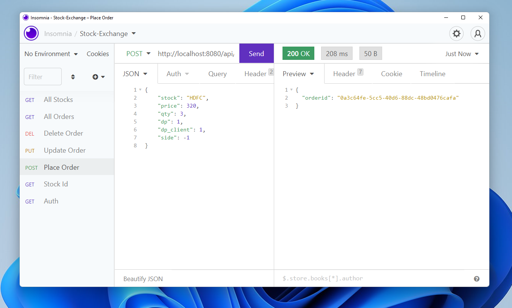
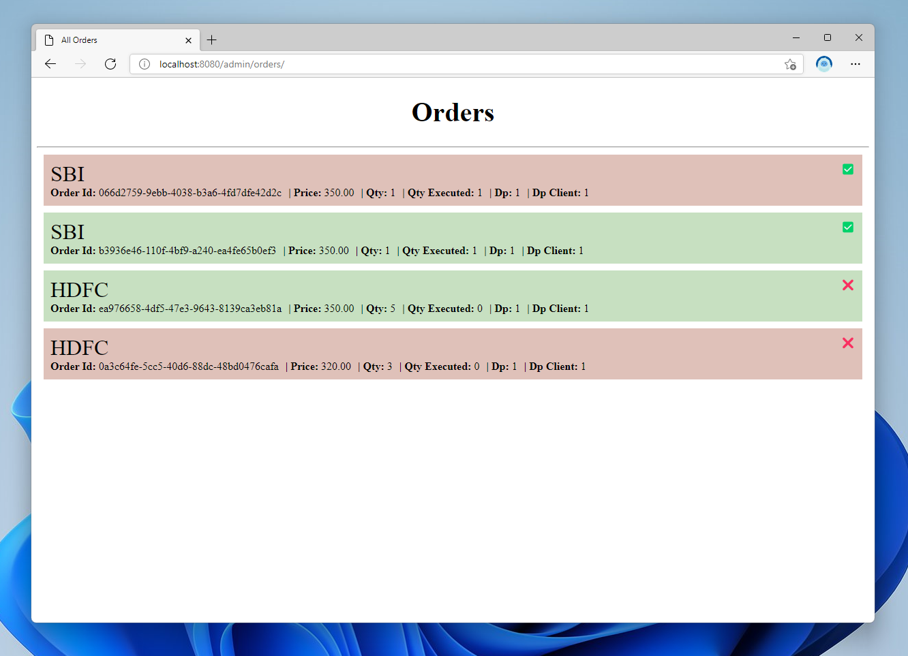

<div align="center">
  
</div>

# Stock-Exchange [Core]
This is a simple project arround build simple stock exchange core processes of matching stock orders. System could be interacted with REST api.

You can place stock orders using REST api. These orders get matched within the database with order matching engine.

## Installing / Getting started

Clone this repo
```sh
git clone https://github.com/Muthu-Palaniyappan-OL/stock-exchange.git
```

Installing Dependancies
```sh 
cd stock-exchange && npm i
```

## Developing

Project was build using 
- Typescript (4.5.4)
- NodeJS (17.3.1)
- PostgresSQL (14)


### Building

```sh
npm run build
```

## Features

- Stock-Exchange has a system of placing orders using REST API.
- Orders placed can be seen visually using /admin/orders/ endpoint.
- Stock Brokers of the stock exchange can only interact with JWT.
- Orders are matched based on their price, qty left, time, etc.

## Demo



Orders with red background color is sell order, green is buy order. Tick mark means order is atleast partially executed.

## Contributing

When you publish something open source, one of the greatest motivations is that
anyone can just jump in and start contributing to your project.

These paragraphs are meant to welcome those kind souls to feel that they are
needed. You should state something like:

"If you'd like to contribute, please fork the repository and use a feature
branch. Pull requests are warmly welcome."

If there's anything else the developer needs to know (e.g. the code style
guide), you should link it here. If there's a lot of things to take into
consideration, it is common to separate this section to its own file called
`CONTRIBUTING.md` (or similar). If so, you should say that it exists here.

## Links

Even though this information can be found inside the project on machine-readable
format like in a .json file, it's good to include a summary of most useful
links to humans using your project. You can include links like:

- Project homepage: https://your.github.com/Muthu-Palaniyappan-OL/stock-exchange
- Repository: https://github.com/Muthu-Palaniyappan-OL/stock-exchange
- Issue tracker: https://github.com/Muthu-Palaniyappan-OL/stock-exchange/issues
  - In case of sensitive bugs like security vulnerabilities, please contact
    my@email.com directly instead of using issue tracker. We value your effort
    to improve the security and privacy of this project!


## Licensing

This project is licensed under 'Apache 2.0'.